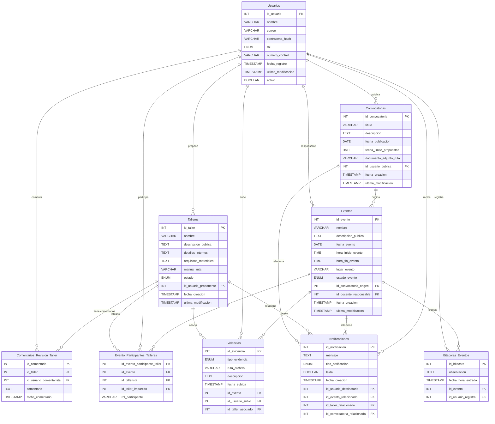

# AcademicPlus

**AcademicPlus** es un sistema de gestión académica. Este proyecto es de código abierto y está diseñado para facilitar la administración de diversas actividades académicas.

## Visión General

AcademicPlus tiene como objetivo proporcionar una plataforma robusta y fácil de usar para la gestión de usuarios, eventos, talleres, convocatorias, evidencias e inscripciones/asignaciones dentro de un entorno académico.

## Licencia

Este proyecto se distribuye bajo la Licencia MIT. [Licencia](/instalador/license.txt)
```text
Copyright (c) [2025] LibreTech

Por la presente se concede permiso, libre de cargos, a cualquier persona que obtenga una copia
de este software y de los archivos de documentación asociados (el "Software"), para tratar
el Software sin restricción, incluyendo sin limitación los derechos
para usar, copiar, modificar, fusionar, publicar, distribuir, sublicenciar, y/o vender
copias del Software, y para permitir a las personas a las que se les proporcione el Software
hacerlo, sujeto a las siguientes condiciones:

El aviso de copyright anterior y este aviso de permiso se incluirán en todas las
copias o partes sustanciales del Software.

EL SOFTWARE SE PROPORCIONA "TAL CUAL", SIN GARANTÍA DE NINGÚN TIPO, EXPRESA O
IMPLÍCITA, INCLUYENDO PERO NO LIMITADO A GARANTÍAS DE COMERCIALIZACIÓN,
IDONEIDAD PARA UN PROPÓSITO PARTICULAR Y NO INFRACCIÓN. EN NINGÚN CASO LOS
AUTORES O TITULARES DEL COPYRIGHT SERÁN RESPONSABLES DE NINGUNA RECLAMACIÓN, DAÑO U
OTRA RESPONSABILIDAD, YA SEA EN UNA ACCIÓN DE CONTRATO, AGRAVIO O CUALQUIER OTRA FORMA,
QUE SURJA DE, FUERA DE O EN CONEXIÓN CON EL SOFTWARE O EL USO U OTROS
TRATOS EN EL SOFTWARE.
```

---

## Detalles del Proyecto

* **Compatibilidad**:
    * Archivo `.jar` ejecutable multiplataforma.
    * Archivo `.exe` para sistemas Windows.
* **Lenguaje de Programación**: Java 8.
* **Entorno de Desarrollo Integrado (IDE)**: NetBeans.
* **Interfaz de Usuario (UI)**: Java Swing.
* **Base de Datos**: MySQL.
* **Mapeo Objeto-Relacional (ORM)**: JPA (EclipseLink).

---

## Requisitos del Sistema

* Tener instalado Java 8 (JDK o JRE) o una versión superior.
* Disponer de un servidor de base de datos MySQL.

---

## Instalación y Ejecución

1.  **Base de Datos**:
    * Asegurar que el servidor MySQL esté en ejecución.
    * Crear una base de datos con el nombre `academicplus`.
    * Ejecutar el script de creación de tablas. [Script](/script-mysql-academicplus.sql)

2.  **Aplicación**:
    * **Desde el archivo `.jar`**: Ejecutar con `java -jar AcademicPlus.jar` (requiere Java instalado).
    * **Desde el archivo `.exe`** (Windows): Ejecutar directamente el archivo.
    * (Añadir cualquier otra instrucción de configuración necesaria, como conexión a la base de datos si no está embebida o se configura en la primera ejecución).

---

## Diseño y Documentación Técnica

La documentación detallada del diseño del sistema se encuentra estructurada de la siguiente manera:

### 1. Diseño de la Base de Datos

El esquema de la base de datos se detalla a continuación y en los scripts de creación.



* **Scripts de las Tablas de Base de Datos:**
    [Script](/script-mysql-academicplus.sql)

### 2. Diseño por Historia de Usuario (HU)
  [Documentación](/recursos/IS_B_11_AcademicPlus.pdf)

### 3. Diseño de la Interacción del Sistema

[Documentación](/recursos/IS_B_11_AcademicPlus.pdf)

---

## Código Fuente y Artefactos

### Clases Adicionales y de Control

* **Clases Adicionales (Modelos de Tabla, etc.):**
[Clases Adicionales](/src/modelo/)
* **Clases de Control de la Interacción y Lógica de Negocio Principal:**
[Clases Adicionales](/src/control/)
### Código de la Interfaz de Usuario (UI)
[Clases Adicionales](/src/vista/)


## Imágenes del Sistema y Base de Datos

* **Imágenes de la Estructura de la Base de Datos con Datos:**
    
* **Imágenes de la Interfaz de Usuario (UI):**
    

---
